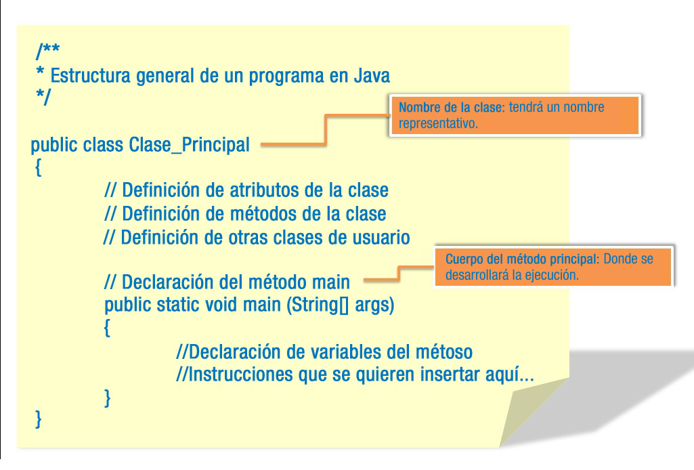
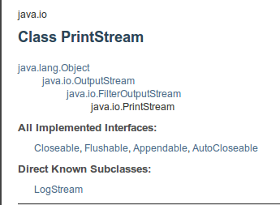

# UD 1. Introducción a la programación

## 1 Introducción

En esta primera unidad realizaremos una revisión de algunos conceptos básicos relacionados con la programación de ordenadores. Muchos de ellos se desarrollarán más en profundidad en unidades posteriores o en otros módulos, pero se considera interesante hablar de ellos antes de empezar a programar en Java.

A continuación, **comenzaremos nuestra exploración de Java analizando programas simples que permiten mostrar diferentes mensajes por consola**. Ello, nos permitirá conocer los elementos básicos de los programas en Java a través programas con una estructura muy sencilla.

Por último, estudiaremos la técnica de descomposición y aprenderemos cómo dividir un programa en Java en múltiples piezas reutilizables denominados métodos. De esta manera, podremos dividir una tarea compleja en subtareas más pequeñas y fáciles de manejar, y evitar la redundancia en nuestros programas.

## 2 Programas y programación

### 2.1 Buscando una solución

| En la vida real... | En programación... |
| :--- | :--- |
| Observación de la situación o problema. |  **Análisis del problema:** requiere que el problema sea definido y comprendido claramente para que pueda ser analizado con todo detalle. |
| Pensamos en una o varias posibles soluciones. |  **Diseño o desarrollo de algoritmos:** procedimiento paso a paso para solucionar el problema dado. |
| Aplicamos la solución que estimamos más adecuada. |  **Resolución del algoritmo elegido en la computadora:** consiste en convertir el algoritmo en programa, ejecutarlo y comprobar que soluciona verdaderamente el problema. |

¿Qué virtudes debería tener nuestra solución?

* **Corrección y eficacia:** si resuelve el problema adecuadamente.
* **Eficiencia:** si lo hace en un tiempo mínimo y con un uso óptimo de los recursos del sistema.

Para conseguirlo, cuando afrontemos la construcción de la solución tendremos que tener en cuenta los siguientes conceptos:

1. **Abstracción:** se trata de realizar un análisis del problema para descomponerlo en problemas más pequeños y de menor complejidad, describiendo cada uno de ellos de manera precisa. **Divide y vencerás,** esta suele ser considerada una filosofía general para resolver problemas y de aquí que su nombre no sólo forme parte del vocabulario informático, sino que también se utiliza en muchos otros ámbitos.
2. **Encapsulación:** consiste en ocultar la información para poder implementarla de diferentes maneras sin que esto influya en el resto de elementos.
3. **Modularidad:** estructuraremos cada parte en módulos independientes, cada uno de ellos tendrá su función correspondiente.

### 2.2 Algoritmos y programas

Después de analizar en detalle el problema a solucionar, hemos de diseñar y desarrollar una solución. Para ello, en muchas ocasiones recurriremos a los algoritmos. Pero, **¿Qué es un algoritmo?**

> **Algoritmo:** secuencia ordenada de pasos, descrita sin ambigüedades, que conducen a la solución de un problema dado.

Los algoritmos son independientes de los lenguajes de programación y de las computadoras donde se ejecutan. Un mismo algoritmo puede ser expresado en diferentes lenguajes de programación y podría ser ejecutado en diferentes dispositivos. Piensa en una receta de cocina, ésta puede ser expresada en castellano, inglés o francés, podría ser cocinada en fogón o vitrocerámica, por un cocinero o más, etc. Pero independientemente de todas estas circunstancias, el plato se preparará siguiendo los mismos pasos.

La diferencia fundamental entre algoritmo y **programa** es que, en el segundo, los pasos que permiten resolver el problema, deben escribirse en un determinado **lenguaje de programación** para que puedan ser ejecutados en el ordenador y así obtener la solución.

**Los lenguajes de programación** son sólo un medio para expresar el algoritmo y el ordenador un procesador para ejecutarlo. El diseño de los algoritmos será una tarea que necesitará de la creatividad y conocimientos de las técnicas de programación. Estilos distintos, de distintos programadores a la hora de obtener la solución del problema, darán lugar a algoritmos diferentes, igualmente válidos.

En esencia, todo problema se puede describir por medio de un algoritmo y las características fundamentales que éstos deben cumplir son:

* Debe ser **preciso** e indicar el orden de realización paso a paso.
* Debe estar **definido**, si se ejecuta dos o más veces, debe obtener el mismo resultado cada vez.
* Debe ser **finito**, debe tener un número finito de pasos.

Pero cuando los problemas son complejos, es necesario descomponer éstos en subproblemas más simples y, a su vez, en otros más pequeños. Estas estrategias reciben el nombre de **diseño descendente** o **diseño modular** \(**top-down design**\). Este sistema se basa en el lema **divide y vencerás**.

Para representar gráficamente los algoritmos que vamos a diseñar, tenemos a nuestra disposición diferentes herramientas que ayudarán a describir su comportamiento de una forma precisa y genérica, para luego poder codificarlos con el lenguaje que nos interese. Entre otras tenemos:

* **Diagramas de flujo:** Esta técnica utiliza símbolos gráficos para la representación del algoritmo. Suele utilizarse en las fases de análisis.
* **Pseudocódigo:** Esta técnica se basa en el uso de palabras clave en lenguaje natural, **constantes**, **variables**, otros objetos, instrucciones y estructuras de programación que expresan de forma escrita la solución del problema. Es la técnica más utilizada actualmente.
* **Tablas de decisión:** En una tabla son representadas las posibles condiciones del problema con sus respectivas acciones. Suele ser una técnica de apoyo al pseudocódigo cuando existen situaciones condicionales complejas.

> A continuación te ofrecemos un enlace a un vídeo en el que puedes ver los elementos gráficos fundamentales que se utilizan para la generación de diagramas de flujo. [https://www.youtube.com/watch?v=tMEscFCEP0g](https://www.youtube.com/watch?v=tMEscFCEP0g)

### 2.3 Lenguajes de programación

Como hemos visto, en todo el proceso de resolución de un problema mediante la creación de software, después del análisis del problema y del diseño del algoritmo que pueda resolverlo, es necesario traducir éste a un lenguaje que exprese claramente cada uno de los pasos a seguir para su correcta ejecución. Este lenguaje recibe el nombre de lenguaje de programación.

> **Lenguaje de programación:** Conjunto de reglas sintácticas y semánticas, símbolos y palabras especiales establecidas para la construcción de programas. Es un lenguaje artificial, una construcción mental del ser humano para expresar programas.

Hay que tener en cuenta que pueden existir sentencias sintácticamente correctas, pero semánticamente incorrectas. Por ejemplo, _“Un avestruz dio un zarpazo a su cuidador”_ está bien construida sintácticamente, pero es evidente que semánticamente no.

Una característica relevante de los lenguajes de programación es, precisamente, que más de un programador pueda usar un conjunto común de instrucciones que sean comprendidas entre ellos. A través de este conjunto se puede lograr la construcción de un programa de forma colaborativa.

Los lenguajes de programación pueden ser clasificados en función de lo cerca que estén del lenguaje humano o del lenguaje de los computadores. El lenguaje de los computadores son códigos binarios, es decir, secuencias de unos y ceros. Detallaremos seguidamente las características principales de los lenguajes de programación.

#### 2.3.1 Lenguaje máquina

Este es el lenguaje utilizado directamente por el procesador, consta de un conjunto de instrucciones codificadas en binario. Es el sistema de códigos directamente interpretable por un **circuito microprogramable**.

Este fue el primer lenguaje utilizado para la programación de computadores. De hecho, cada máquina tenía su propio conjunto de instrucciones codificadas en ceros y unos. Cuando un algoritmo está escrito en este tipo de lenguaje, decimos que está en código máquina.

 Programar en este tipo de lenguaje presentaba los siguientes inconvenientes:

* Cada programa era válido sólo para un tipo de procesador u ordenador.
* La lectura o interpretación de los programas era extremadamente difícil y, por tanto, insertar modificaciones resultaba muy costoso.
* Los programadores de la época debían memorizar largas combinaciones de ceros y unos, que equivalían a las instrucciones disponibles para los diferentes tipos de procesadores.
* Los programadores se encargaban de introducir los códigos binarios en el computador, lo que provocaba largos tiempos de preparación y posibles errores.

A continuación, se muestran algunos códigos binarios equivalentes a las operaciones de suma, resta y movimiento de datos en lenguaje máquina.

| Operación | Lenguaje máquina |
| :--- | :--- |
| SUMAR | 00101101 |
| RESTAR | 00010011 |
| MOVER | 00111010 |

Dada la complejidad y dificultades que ofrecía este lenguaje, fue sustituido por otros más sencillos y fáciles utilizar. No obstante, hay que tener en cuenta que todos los programas para poder ser ejecutados, han de traducirse siempre al lenguaje máquina que es el único que entiende la computadora.

#### 2.3.2 Lenguaje Ensamblador

La evolución del lenguaje máquina fue el lenguaje ensamblador. Las instrucciones ya no son secuencias binarias, se sustituyen por códigos de operación que describen una operación elemental del procesador. Es un lenguaje de bajo nivel, al igual que el lenguaje máquina, ya que dependen directamente del hardware donde son ejecutados.

> **Mnemotécnico:** son palabras especiales, que sustituyen largas secuencias de ceros y unos, utilizadas para referirse a diferentes operaciones disponibles en el juego de instrucciones que soporta cada máquina en particular.

En ensamblador, cada instrucción \(mnemotécnico\) se corresponde a una instrucción del procesador. En la siguiente tabla se muestran algunos ejemplos.

| Operación | Lenguaje Ensamblador |
| :--- | :--- |
| MULTIPLICAR | MUL |
| DIVIDIR | DIV |
| MOVER | MOV |

En el siguiente gráfico puedes ver parte de un programa escrito en lenguaje ensamblador. En color rojo se ha resaltado el código máquina en **hexadecimal**, en magenta el código escrito en ensamblador y en azul, las direcciones de memoria donde se encuentra el código.


Pero aunque ensamblador fue un intento por aproximar el lenguaje de los procesadores al lenguaje humano, presentaba múltiples dificultades:

* Los programas seguían dependiendo directamente del hardware que los soportaba.
* Los programadores tenían que conocer detalladamente la máquina sobre la que programaban, ya que debían hacer un uso adecuado de los recursos de dichos sistemas.
* La lectura, interpretación o modificación de los programas seguía presentando dificultades.

Todo programa escrito en lenguaje ensamblador necesita de un intermediario, que realice la traducción de cada una de las instrucciones que componen su código al lenguaje máquina correspondiente. Este intermediario es el programa ensamblador. El programa original escrito en lenguaje ensamblador constituye el código fuente y el programa traducido al lenguaje máquina se conoce como programa objeto que será directamente ejecutado por la computadora.

#### 2.3.3 Lenguajes compilados

Para paliar los problemas derivados del uso del lenguaje ensamblador y con el objetivo de acercar la programación hacia el uso de un lenguaje más cercano al humano que al del computador, nacieron los lenguajes compilados. Algunos ejemplos de este tipo de lenguajes son: Pascal, Fortran, Algol, C, **C++**, etc.

Al ser lenguajes más cercanos al humano, también se les denomina **lenguajes de alto nivel**. Son más fáciles de utilizar y comprender, las instrucciones que forman parte de estos lenguajes utilizan palabras y signos reconocibles por el programador.

¿Cuáles son sus **ventajas**?

* Son mucho más fáciles de aprender y de utilizar que sus predecesores.
* Se reduce el tiempo para desarrollar programas, así como los costes.
* Son independientes del hardware, los programas pueden ejecutarse en diferentes tipos de máquina.
* La lectura, interpretación y modificación de los programas es mucho más sencilla.

Pero un programa que está escrito en un lenguaje de alto nivel también tiene que traducirse a un código que pueda utilizar la máquina. Los programas traductores que pueden realizar esta operación se llaman compiladores.

> **Compilador:** es un programa cuya función consiste en traducir el código fuente de un programa escrito en un lenguaje de alto nivel a lenguaje máquina. Al proceso de traducción se le conoce con el nombre de compilación.

Para ilustrar el proceso de compilación de programas te proponemos el siguiente equema:


El compilador realizará la traducción y además informará de los posibles errores. Una vez subsanados, se generará el programa traducido a código máquina, conocido como **código objeto**. Este programa aún no podrá ser ejecutado hasta que no se le añadan los módulos de enlace o bibliotecas, durante el proceso de enlazado. Una vez finalizado el enlazado, se obtiene el **código ejecutable**.

#### 2.3.4 Lenguajes interpretados

Se caracterizan por estar diseñados para que su ejecución se realice a través de un **intérprete**. Cada instrucción escrita en un lenguaje interpretado se analiza, traduce y ejecuta tras haber sido verificada. Una vez realizado el proceso por el intérprete, la instrucción se ejecuta, pero no se guarda en memoria.

> **Intérprete:** es un programa traductor de un lenguaje de alto nivel en el que el proceso de traducción y de ejecución se llevan a cabo simultáneamente, es decir, la instrucción se pasa a lenguaje máquina y se ejecuta directamente. No se genera programa objeto, ni programa ejecutable.

Los lenguajes interpretados generan programas de menor tamaño que los generados por un compilador, al no guardar el programa traducido a código máquina. Pero presentan el inconveniente de ser algo más lentos, ya que han de ser traducidos durante su ejecución. Por otra parte, necesitan disponer en la máquina del programa intérprete ejecutándose, algo que no es necesario en el caso de un programa compilado, para los que sólo es necesario tener el programa ejecutable para poder utilizarlo.

Ejemplos de lenguajes interpretados son: **Perl, PHP, Python, JavaScript,** etc.

A medio camino entre los lenguajes compilados y los interpretados, existen los lenguajes que podemos denominar **pseudo-compilados o pseudo-interpretados**, es el caso del **Lenguaje Java**. Java puede verse como compilado e interpretado a la vez, ya que su código fuente se compila para obtener el código binario en forma de bytecodes, que son estructuras parecidas a las instrucciones máquina, con la importante propiedad de no ser dependientes de ningún tipo de máquina \(se detallarán más adelante\). La Máquina Virtual Java se encargará de interpretar este código y, para su ejecución, lo traducirá a código máquina del procesador en particular sobre el que se esté trabajando.

### 2.4 El lenguaje de programación Java

#### 2.4.1 ¿Qué y cómo es Java?

Java es un lenguaje sencillo de aprender, con una sintaxis parecida a la de C++, pero en la que se han eliminado elementos complicados y que pueden originar errores. Java es orientado a objetos, con lo que elimina muchas preocupaciones al programador y permite la utilización de gran cantidad de bibliotecas ya definidas, evitando reescribir código que ya existe. Es un lenguaje de programación creado para satisfacer nuevas necesidades que los lenguajes existentes hasta el momento no eran capaces de solventar.

Una de las principales virtudes de Java es su independencia del hardware, ya que el código que se genera es válido para cualquier plataforma. Este código será ejecutado sobre una máquina virtual denominada **Maquina Virtual Java** \(MVJ o JVM – Java Virtual Machine\), que interpretará el código convirtiéndolo a código específico de la plataforma que lo soporta. De este modo el programa se escribe una única vez y puede hacerse funcionar en cualquier lugar. Lema del lenguaje: _**“Write once, run everywhere”.**_

Antes de que apareciera Java, el lenguaje C era uno de los más extendidos por su versatilidad. Pero cuando los programas escritos en C aumentaban de volumen, su manejo comenzaba a complicarse. Mediante las técnicas de programación estructurada y programación modular se conseguían reducir estas complicaciones, pero no era suficiente.

Fue entonces cuando la Programación Orientada a Objetos \(POO\) entra en escena, aproximando notablemente la construcción de programas al pensamiento humano y haciendo más sencillo todo el proceso. Los problemas se dividen en objetos que tienen propiedades e interactúan con otros objetos, de este modo, el programador puede centrarse en cada objeto para programar internamente los elementos y funciones que lo componen.

Las características principales de lenguaje Java se resumen a continuación:

* El código generado por el compilador Java es independiente de la arquitectura.
* Está totalmente orientado a objetos.
* Su sintaxis es similar a C y C++.
* Es distribuido, preparado para aplicaciones **TCP/IP**.
* Dispone de un amplio conjunto de bibliotecas.
* Es robusto, realizando comprobaciones del código en tiempo de compilación y de ejecución.
* La seguridad está garantizada, ya que las aplicaciones Java no acceden a zonas delicadas de memoria o de sistema.

> **Debes Conocer**
>
> Obtén una descripción detallada de las características reseñadas anteriormente a través del siguiente artículo: [Características detalladas del lenguaje Java](http://es.wikibooks.org/wiki/Programaci%C3%B3n_en_Java/Caracter%C3%ADsticas_del_lenguaje)

#### 2.4.1 Breve historia

Java surgió en 1991 cuando un grupo de ingenieros de Sun Microsystems trataron de diseñar un nuevo lenguaje de programación destinado a programar pequeños dispositivos electrónicos. La dificultad de estos dispositivos es que cambian continuamente y para que un programa funcione en el siguiente dispositivo aparecido, hay que rescribir el código. Por eso la empresa Sun quería crear un lenguaje **independiente del dispositivo.**

Pero no fue hasta 1995 cuando pasó a llamarse **Java**, dándose a conocer al público como lenguaje de programación para computadores. Java pasa a ser un lenguaje totalmente independiente de la plataforma y a la vez potente y orientado a objetos. Esa filosofía y su facilidad para crear aplicaciones para redes TCP/IP ha hecho que sea uno de los lenguajes más utilizados en la actualidad.

El factor determinante para su expansión fue la incorporación de un intérprete Java en la versión 2.0 del navegador Web Netscape Navigator, lo que supuso una gran revuelo en Internet. A principios de 1997 apareció **Java 1.1** que proporcionó sustanciales mejoras al lenguaje. **Java 1.2**, más tarde rebautizado como **Java 2,** nació a finales de 1998.

El principal objetivo del lenguaje Java es llegar a ser el **nexo universal** que conecte a los usuarios con la información, esté ésta situada en el ordenador local, en un servidor Web, en una base de datos o en cualquier otro lugar.

Para el desarrollo de programas en lenguaje Java es necesario utilizar un entorno de desarrollo denominado **JDK** \(Java Development Kit\), que provee de un compilador y un entorno de ejecución \(**JRE** – Java Run Environment\) para los bytecodes generados a partir del código fuente. Al igual que las diferentes versiones del lenguaje han incorporado mejoras, el entorno de desarrollo y ejecución también ha sido mejorado sucesivamente.

**Java 2** es la tercera versión del lenguaje, pero es algo más que un lenguaje de programación, incluye los siguientes elementos:

* Un lenguaje de programación: Java.
* Un conjunto de bibliotecas estándar que vienen incluidas en la plataforma y que son necesarias en todo entorno Java. Es el Java Core.
* Un conjunto de herramientas para el desarrollo de programas, como es el compilador de bytecodes, el generador de documentación, un depurador, etc.
* Un entorno de ejecución que en definitiva es una máquina virtual que ejecuta los programas traducidos a bytecodes.

El siguiente esquema muestra los elementos fundamentales de la plataforma de desarrollo Java 2.  


Actualmente hay tres ediciones de la plataforma Java 2:

* **J2SE**: Entorno de Sun relacionado con la creación de aplicaciones y **applets** en lenguaje Java.
* **J2EE**: Pensada para la creación de aplicaciones Java empresariales y del lado del servidor.
* **J2ME**: Pensada para la creación de aplicaciones Java para dispositivos móviles.

> **Para saber más**
>
> Si deseas conocer más sobre los orígenes del lenguaje Java, aquí te ofrecemos más información: 
>
> * [Historia de Java](http://es.wikipedia.org/wiki/Java_%28lenguaje_de_programaci%C3%B3n%29#Historia)
> * [Línea de tiempo de la historia de Java](https://www.timetoast.com/timelines/evolution-of-the-smart-car)

#### 2.4.3 Independencia de la plataforma y trabajo en red

Existen dos características que distinguen a **Java** de otros lenguajes, como son la **independencia de la plataforma** y la posibilidad de trabajar en red o, mejor, la posibilidad de **crear aplicaciones que trabajan en red**.

Estas características las vamos a explicar a continuación:

1.  **Independencia:** Los programas escritos en Java pueden ser ejecutados en cualquier tipo de hardware. El código fuente es compilado, generándose el código conocido como **Java Bytecode** \(instrucciones máquina simplificadas que son específicas de la plataforma Java\), el bytecode será interpretado y ejecutado en la **Máquina Virtual** **Java \(MVJ o JVM – Java Virtual Machine\)** que es un programa escrito en código nativo de la plataforma destino entendible por el hardware. Con esto se evita tener que realizar un programa diferente para cada CPU o plataforma.

   Por tanto, la parte que realmente es dependiente del sistema es la Máquina Virtual Java, así como las librerías o bibliotecas básicas que permiten acceder directamente al hardware de la máquina.

2. **Trabajo en red:** Esta capacidad del lenguaje ofrece múltiples posibilidades para la comunicación vía TCP/IP. Para poder hacerlo existen librerías que permiten el acceso y la interacción con protocolos como **http**, **ftp**, etc., facilitando al programador las tareas del tratamiento de la información a través de redes.

#### 2.4.4 Seguridad y simplicidad

Junto a las características diferenciadoras del lenguaje Java relacionadas con la independencia y el trabajo en red, han de destacarse dos virtudes que hacen a este lenguaje uno de los más extendidos entre la comunidad de programadores: su seguridad y su simplicidad.

1.  **Seguridad:** En primer lugar, los posibles accesos a zonas de memoria “sensibles” que en otros lenguajes como C y C++ podían suponer peligros importantes, se han eliminado en Java.

   En segundo lugar, el código Java es comprobado y verificado para evitar que determinadas secciones del código produzcan efectos no deseados. Los test que se aplican garantizan que las operaciones, operandos, conversiones, uso de clases y demás acciones son seguras.

   Y en tercer lugar, Java no permite la apertura de ficheros en la máquina local, tampoco permite ejecutar ninguna aplicación nativa de una plataforma e impide que se utilicen otros ordenadores como puente, es decir, nadie puede utilizar nuestra máquina para hacer peticiones o realizar operaciones con otra.

   En definitiva, podemos afirmar que Java es un lenguaje seguro.

2.  **Simplicidad:** Aunque Java es tan potente como C o C++, es bastante más sencillo. Posee una curva de aprendizaje muy rápida y, para alguien que comienza a programar en este lenguaje, le resulta relativamente fácil comenzar a escribir aplicaciones interesantes.

   Si has programado alguna vez en C o C++ encontrarás que Java te pone las cosas más fáciles, ya que se han eliminado: la aritmética de **punteros**, los registros, la definición de tipos, la gestión de memoria, etc. Con esta simplificación se reduce bastante la posibilidad de cometer errores comunes en los programas. Un programador experimentado en C o C++ puede cambiar a este lenguaje rápidamente y obtener resultados en muy poco espacio de tiempo.

   Muy relacionado con la simplicidad que aporta Java está la incorporación de un elemento muy útil como es el **Recolector de Basura \(Garbage collector\)**. Permite al programador liberarse de la gestión de la memoria y hace que ciertos bloques de memoria puedan reaprovecharse, disminuyendo el número de huecos libres \(**fragmentación de memoria**\).

   Cuando realicemos programas, crearemos objetos, haremos que éstos interaccionen, etc. Todas estas operaciones requieren de uso de memoria del sistema, pero la gestión de ésta será realizada de manera transparente al programador. Todo lo contrario que ocurría en otros lenguajes. Podremos crear tantos objetos como solicitemos, pero nunca tendremos que destruirlos. El entorno de Java borrará los objetos cuando determine que no se van a utilizar más. Este proceso es conocido como recolección de basura.

#### 2.4.5 Java y los Bytecodes

Un programa escrito en Java no es directamente ejecutable, es necesario que el código fuente sea interpretado por la Maquina Virtual Java. ¿Cuáles son los pasos que se siguen desde que se genera el código fuente hasta que se ejecuta? A continuación se detallan cada uno de ellos.  


Una vez escrito el código fuente \(archivos con extensión `.Java`\), éste es precompilado generándose los códigos de bytes, Bytecodes o Java Bytecodes \(archivos con extensión `.class`\) que serán interpretados directamente por la Maquina Virtual Java y traducidos a código nativo de la plataforma sobre la que se esté ejecutando el programa. **Bytecode:** Son un conjunto de instrucciones en lenguaje máquina que no son específicas a ningún procesador o sistema de cómputo. Un intérprete de código de bytes \( bytecodes \) para una plataforma específica será quien los ejecute. A estos intérpretes también se les conoce como Máquinas Virtuales Java o intérpretes Java de tiempo de ejecución.

En el proceso de precompilación, existe un verificador de códigos de bytes que se asegurará de que se cumplen las siguientes condiciones:

* El código satisface las especificaciones de la Máquina Virtual Java.
* No existe amenaza contra la integridad del sistema.
* No se producen desbordamientos de memoria.
* Los parámetros y sus tipos son adecuados.
* No existen conversiones de datos no permitidas.

Para que un bytecode pueda ser ejecutado en cualquier plataforma, es imprescindible que dicha plataforma cuente con el intérprete adecuado, es decir, la máquina virtual específica para esa plataforma. En general, la Máquina Virtual Java es un programa de reducido tamaño y gratuito para todos los sistemas operativos.


#### 2.4.6 Tipo de aplicaciones en Java

La versatilidad del lenguaje de programación Java permite al programador crear distintos tipos de aplicaciones. A continuación, describiremos las características más relevantes de cada uno de ellos:

* **Aplicaciones de consola:**
  * Son programas independientes al igual que los creados con los lenguajes tradicionales.
  * Se componen como mínimo de un archivo `.class` que debe contar necesariamente con el método `main`.
  * No necesitan un navegador web y se ejecutan cuando invocamos el comando Java para iniciar la Máquina Virtual de Java \(JVM\). De no encontrarse el método `main` la aplicación no podrá ejecutarse.
  *  Las aplicaciones de consola leen y escriben hacia y desde la entrada y salida estándar, sin ninguna interfaz gráfica de usuario.
* **Aplicaciones gráficas:**
  * Aquellas que utilizan las clases con capacidades gráficas, como Swing que es la biblioteca para la interfaz gráfica de usuario avanzada de la plataforma Java SE.
  *  Incluyen las instrucciones `import`, que indican al compilador de Java que las clases del paquete `Javax.swing` se incluyan en la compilación.
* **Applets:**
  * Son programas incrustados en otras aplicaciones, normalmente una página web que se muestra en un navegador. Cuando el navegador carga una web que contiene un applet, éste se descarga en el navegador web y comienza a ejecutarse. Esto nos permite crear programas que cualquier usuario puede ejecutar con tan solo cargar la página web en su navegador.
  * Se pueden descargar de Internet y se observan en un navegador. Los applets se descargan junto con una página HTML desde un servidor web y se ejecutan en la máquina cliente.
  * No tienen acceso a partes sensibles \(por ejemplo: no pueden escribir archivos\), a menos que uno mismo le dé los permisos necesarios en el sistema.
  * No tienen un método principal.
  *  Son multiplataforma y pueden ejecutarse en cualquier navegador que soporte Java.
* **Servlets:**
  * Son componentes de la parte del servidor de Java EE, encargados de generar respuestas a las peticiones recibidas de los clientes.
  *  Los servlets, al contrario de los applets, son programas que están pensados para trabajar en el lado del servidor y desarrollar aplicaciones Web que interactúen con los clientes.
* **Midlets:**
  * Son aplicaciones creadas en Java para su ejecución en sistemas de propósito simple o dispositivos móviles. Los juegos Java creados para teléfonos móviles son midlets.
  * Son programas creados para dispositivos embebidos \(se dedican a una sola actividad\), más específicamente para la máquina virtual Java MicroEdition \(Java ME\).
  * Generalmente son juegos y aplicaciones que se ejecutan en teléfonos móviles.

## 3 Entornos Integrados de Desarrollo \(IDE\)

En los comienzos de Java la utilización de la línea de comandos era algo habitual. El programador escribía el código fuente empleando un editor de texto básico, seguidamente, pasaba a utilizar un compilador y con él obtenía el código compilado. En un paso posterior, necesitaba emplear una tercera herramienta para el ensamblado del programa. Por último, podía probar a través de la línea de comandos el archivo ejecutable. El problema surgía cuando se producía algún error, lo que provocaba tener que volver a iniciar el proceso completo.

Estas circunstancias hacían que el desarrollo de software no estuviera optimizado. Con el paso del tiempo, se fueron desarrollando aplicaciones que incluían las herramientas necesarias para realizar todo el proceso de programación de forma más sencilla, fiable y rápida. Para cada lenguaje de programación existen múltiples entornos de desarrollo, cada uno con sus ventajas e inconvenientes. Dependiendo de las necesidades de la persona que va a programar, la facilidad de uso o lo agradable que le resulte trabajar con él, se elegirá entre unos u otros entornos.

### 3.1 ¿Qué son?

Son aplicaciones que ofrecen la posibilidad de llevar a cabo el proceso completo de desarrollo de software a través de un único programa. Podremos realizar las labores de edición, compilación, depuración, detección de errores, corrección y ejecución de programas escritos en Java o en otros lenguajes de programación, bajo un entorno gráfico \(no mediante línea de comandos\). Junto a las capacidades descritas, cada entorno añade otras que ayudan a realizar el proceso de programación, como por ejemplo: código fuente coloreado, plantillas para diferentes tipos de aplicaciones, creación de proyectos, etc.

Hay que tener en cuenta que un entorno de desarrollo no es más que una fachada para el proceso de compilación y ejecución de un programa. ¿Qué quiere decir eso? Pues que si tenemos instalado un IDE y no tenemos instalado el compilador, no tenemos nada.

### **3.2 IDE's actuales**

Existen en el mercado multitud de entornos de desarrollo para el lenguaje Java, los hay de libre distribución, de pago, para principiantes, para profesionales, que consumen más recursos, que son más ligeros, más amigables, más complejos que otros, etc.

Entre los que son gratuitos o de libre distribución tenemos:

* **NetBeans**
* **Eclipse**
* **BlueJ**
* **jGRASP**
* **Jcreator LE**

Entre los que son propietarios o de pago tenemos:

* **IntelliJ IDEA**
* **Jbuilder**
* **Jcreator**
* **JDeveloper**


Pero, ¿cuál o cuáles son los más utilizados por la comunidad de programadores Java? El puesto de honor se lo disputan entre **Eclipse, NetBeans** y IntelliJ IDEA. Los dos primeros son gratuitos, con soporte de idiomas y multiplataforma \(Windows, Linux, MacOS\).  
  
¿Y cuál será con el que vamos a trabajar? Pues aunque parezca mentira, ninguno de ellos. Vamos a utilizar [**jGRASP**](http://www.jgrasp.org/index.html) , un entorno de desarrollo ligero, creado por la Universidad de Auburn para mejorar la comprensión del software y facilitar el aprendizaje de la programación. Está desarrollado en Java y funciona con Windows, Linux y MacOS sobre máquinas virtuales de Java.

### **3.3 El entorno jGRASP**

jGRASP es un entorno de desarrollo ligero que ha sido específicamente creado para proporcionar herramientas de visualización de software que facilitan la conprensión del código a programadores principiantes.

En concreto proporciona 3 herramientas principales de visualización: 

* Diagramas de estructuras de control para visualización de código fuente
* Diagramas de clases UML para visualizar la arquitectura de proyectos
* Visor de datos primitivos y objetos en tiempo de ejecución

Así mismo, incluye un entorno de trabajo innovador, un debugger y la ventana "Interactions" que nos permite probar código sin crear un programa completo.

Ha sido desarrollado en Java por la Universidad de Auburn, por lo que funciona en cualquier plataforma que tenga la máquina virtual de Java instalada. La página oficial de Java proporciona descargas para Windows, Mac OS y Linux.

Soporta  Java,  C,  C++,  Objective-C,  Python,  Ada,  y VHDL. Por ello, no es un IDE profesional sino un IDE pensado para estudiantes que están aprendiendo a programar.  La mayoría de sus funcionalidad se orientan a facilitar la comprensión del funcionamiento del código y no a facilitar la generación de código.

## 4. Mi primer programa en Java

Hasta ahora, hemos descrito el lenguaje de programación Java, hemos hecho un recorrido por su historia y nos hemos instruido sobre su filosofía de trabajo, pero te preguntarás ¿Cuándo empezamos a desarrollar programas? ¿Qué elementos forman parte de un programa en Java? ¿Qué se necesita para programar en este lenguaje? ¿Podemos crear programas de diferente tipo?

No te impacientes, cada vez estamos más cerca de comenzar la experiencia con el lenguaje de programación Java. Iniciaremos nuestro camino conociendo cuales son los elementos básicos de un programa Java, la forma en que debemos escribir el código y los tipos de aplicaciones que pueden crearse en este lenguaje.

### 4.1 Estructura básica de un programa

En el gráfico al que puedes acceder a continuación, se presenta la estructura general de un programa realizado en un lenguaje orientado a objetos como es Java.



Vamos a analizar cada uno de los elementos que aparecen en dicho gráfico:

* **public class Clase\_Principal**: Todos los programas han de incluir una clase como esta. Es una clase general en la que se incluyen todos los demás elementos del programa. Entre otras cosas, contiene el método o función `main()` que representa al programa principal, desde el que se llevará a cabo la ejecución del programa. Esta clase puede contener a su vez otras clases del usuario, pero sólo una puede ser `public`. El nombre del fichero `.Java` que contiene el código fuente de nuestro programa, coincidirá con el nombre de la clase que estamos describiendo en estas líneas.
* **public static void main \(String\[\] args\)**: Es el método que representa al programa principal, en él se podrán incluir las instrucciones que estimemos oportunas para la ejecución del programa. Desde él se podrá hacer uso del resto de clases creadas. Todos los programas Java tienen un método `main`.
* **Comentarios**: los comentarios se suelen incluir en el código fuente para realizar aclaraciones, anotaciones o cualquier otra indicación que el programador estime oportuna. Estos comentarios pueden introducirse de dos formas, **con** `//` y **con** `/* */`. Con la primera forma estaríamos estableciendo una única línea completa de comentario y, con la segunda, con `/*` comenzaríamos el comentario y éste no terminaría hasta que no insertáramos `*/`.
* **Bloques de código**: son conjuntos de instrucciones que se marcan mediante la apertura y cierre de llaves `{ }`. El código así marcado es considerado interno al bloque.
* **Punto y coma**: aunque en el ejemplo no hemos incluido ninguna línea de código que termine con punto y coma, hay que hacer hincapié en que cada línea de código ha de terminar con punto y coma \(`;`\). En caso de no hacerlo, tendremos errores sintácticos. ****

> **Recomendación:**
>
> Ten en cuenta que **Java distingue entre mayúsculas y minúsculas**. Si le das a la clase principal el nombre PrimerPrograma, el archivo **`.Java`** tendrá como identificador **PrimerPrograma.Java**, que es totalmente diferente a primerprograma.Java. Además, para Java los elementos PrimerPrograma y primerprograma serían considerados dos clases diferentes dentro del código fuente.

### 4.2 Identificadores

Como hemos visto en un programa vamos a encontrar clases y métodos a los que tendremos que dar un nombre lo más representativo posible para que nos ayude a entender el programa. Al nombre que le damos se le llama **identificador**.

Los identificadores permiten nombrar los elementos que se están manejando en un programa. Vamos a ver con más detalle ciertos aspectos sobre los identificadores que debemos tener en cuenta.

#### 4.2.1 Identificadores

Un **identificador** en Java es una secuencia ilimitada sin espacios de letras y dígitos **Unicode**, de forma que **el primer símbolo de la secuencia debe ser una letra, un símbolo de subrayado \(\_\) o el símbolo dólar \($\)**. Por ejemplo, son válidos los siguientes identificadores:  

```text
$x5      ατη    NUM_MAX    _numCuenta
```

En la definición anterior decimos que un identificador es una secuencia ilimitada de caracteres Unicode. Pero… ¿qué es Unicode? Unicode es un código de caracteres o sistema de codificación, un alfabeto que recoge los caracteres de prácticamente todos los idiomas importantes del mundo. Las líneas de código en los programas se escriben usando ese conjunto de caracteres Unicode.

Esto quiere decir que en Java se pueden utilizar varios alfabetos como el Griego, Árabe o Japonés. De esta forma, los programas están más adaptados a los lenguajes e idiomas locales, por lo que son más significativos y fáciles de entender tanto para los programadores que escriben el código, como para los que posteriormente lo tienen que interpretar, para introducir alguna nueva funcionalidad o modificación en la aplicación.

El estándar Unicode originalmente utilizaba 16 bits, pudiendo representar hasta 65.536 caracteres distintos, que es el resultado de elevar dos a la potencia dieciséis. Actualmente Unicode puede utilizar más o menos bits, dependiendo del formato que se utilice: **UTF-8**, **UTF-16** ó **UTF-32. A cada carácter le corresponde unívocamente un número entero perteneciente al intervalo de 0 a 2 elevado a n, siendo n el número de bits utilizados para representar los caracteres. Por ejemplo, la letra** ñ es el entero 164. Además, el código Unicode es “compatible” con el código ASCII, ya que para los caracteres del código ASCII, Unicode asigna como código los mismos 8 bits, a los que les añade a la izquierda otros 8 bits todos a cero. La conversión de un carácter ASCII a Unicode es inmediata.

> **Recomendación**: Una buena práctica de programación es seleccionar nombres adecuados para las variables, eso ayuda a que el programa se autodocumente, y evita un número excesivo de comentarios para aclarar el código.

#### 4.2.2 Convenios y reglas para nombrar variables

A la hora de nombrar un identificador existen una serie de normas de estilo de uso generalizado que, no siendo obligatorias, se usan en la mayor parte del código Java. Estas reglas para la nomenclatura de variables son las siguientes:

* **Java distingue las mayúsculas de las minúsculas**. Por ejemplo, `Alumno` y `alumno` son variables diferentes.
* **No se suelen utilizar identificadores que comiencen con «$» o «\_»,** además el símbolo del dólar, por convenio, no se utiliza nunca.
* **No se puede utilizar el valor booleano** \(`true` o `false`\) **ni el valor nulo** \(`null`\).
* Los **identificadores deben ser lo más descriptivos posibles**. Es mejor usar palabras completas en vez de abreviaturas crípticas. Así nuestro código será más fácil de leer y comprender. En muchos casos también hará que nuestro código se autodocumente. Por ejemplo, si tenemos que darle el nombre a una variable que almacena los datos de un cliente sería recomendable que la misma se llamara algo así como `FicheroClientes` o `ManejadorCliente`, y no algo poco descriptivo como `Cl33`.

Además de estas restricciones, en la siguiente tabla puedes ver otras convenciones, que no siendo obligatorias, sí son recomendables a la hora de crear identificadores en Java.

| Identificador | Convención | Ejemplo |
| :--- | :--- | :--- |
| Variable | Comienza por letra minúscula, y si tienen más de una palabra se colocan juntas y el resto comenzando por mayúsculas. | `numAlumnos, suma` |
| Constante | En letras mayúsculas, separando las palabras con el guión bajo, por convenio el guión bajo no se utiliza en ningún otro sitio. | `TAM_MAX, PI` |
| Clase | Comienza por letra mayúscula. | `String, MiTipo` |
| Método | Comienza con letra minúscula y sigue las mismas reglas que las variables | `modificaValor, obtieneValor` |

#### 4.2.3 Palabras reservadas

Las palabras reservadas, a veces también llamadas palabras clave o keywords , son secuencias de caracteres formadas con letras ASCII cuyo uso se reserva al lenguaje y, por tanto, **no pueden utilizarse para crear identificadores.**

 Las palabras reservadas en Java son:

|  |  |  |  |  |
| :--- | :--- | :--- | :--- | :--- |
| `abstract` | `continue` | `for` | `new` | `switch` |
| `assert` | `default` | `goto` | `package` | `synchronized` |
| `boolean` | `do` | `if` | `private` | `this` |
| `break` | `double` | `implements` | `protected` | `throw` |
| `byte` | `else` | `import` | `public` | `throws` |
| `case` | `enum` | `instanceof` | `return` | `transient` |
| `catch` | `extends` | `int` | `short` | `try` |
| `char` | `final` | `interface` | `static` | `void` |
| `class` | `finally` | `long` | `strictfcode` | `volatile` |
| `const` | `float` | `native` | `super` | `while` |

Hay palabras reservadas que no se utilizan en la actualidad, como es el caso de `const` y `goto`, que apenas se utilizan en la actual implementación del lenguaje Java. Por otro lado, puede haber otro tipo de palabras o texto en el lenguaje que aunque no sean palabras reservadas tampoco se pueden utilizar para crear identificadores. Es el caso de `true` y `false` que, aunque puedan parecer palabras reservadas, porque no se pueden utilizar para ningún otro uso en un programa, técnicamente son **literales booleanos**. Igualmente, null es considerado un literal, no una palabra reservada.

> Cuando tras haber consultado la documentación de Java aún no tengas seguridad de cómo funciona alguna de sus características, pruébala en tu ordenador, y analiza cada mensaje de error que te dé el compilador para corregirlo. Busca en foros de Internet errores similares para ayudarte de la experiencia de otros usuarios y usuarias.

### 4.3 Salida por pantalla

La salida por pantalla en Java se hace con el objeto `System.out`. Este objeto es una instancia de la clase `PrintStream` del paquete `java.lang`. Si miramos la API de `PrintStream` obtendremos la variedad de métodos para mostrar datos por pantalla, algunos de estos son:  



* `void print(String s):` Escribe una cadena de texto.
* `void println(String x):` Escribe una cadena de texto y termina la línea.

En la orden `print` y `println`, cuando queramos escribir un mensaje y el valor de una variable debemos utilizar el operador de concatenación de cadenas \(+\), por ejemplo:

```java
System.out.println(“Bienvenido, “ + nombre);
```

Escribe el mensaje de `"Bienvenido, Carlos"`, si el valor de la variable `nombre` es Carlos.

Existen unos caracteres especiales que se representan utilizando **secuencias de escape**:

| Secuencia de escape | Significado | Secuencia de escape | Significado |
| :--- | :--- | :--- | :--- |
| `\b` | Retroceso | `\r` | Retorno de carro |
| `\t` | Tabulador | `\''` | Carácter comillas dobles |
| `\n` | Salto de línea | `\'` | Carácter comillas simples |
| `\f` | Salto de página | `\\` | Barra diagonal |

### 4.4 Comentarios

Los comentarios son muy importantes a la hora de describir qué hace un determinado programa. A lo largo de la unidad los hemos utilizado para documentar los ejemplos y mejorar la comprensión del código. Para lograr ese objetivo, es normal que cada programa comience con unas líneas de comentario que indiquen, al menos, una breve descripción del programa, el autor del mismo y la última fecha en que se ha modificado.

Todos los lenguajes de programación disponen de alguna forma de introducir comentarios en el código. En el caso de Java, nos podemos encontrar los siguientes tipos de comentarios:

* **Comentarios de una sola línea**. Utilizaremos el delimitador `//` para introducir comentarios de sólo una línea.

```text
// comentario de una sola línea
```

* **Comentarios de múltiples líneas**. Para introducir este tipo de comentarios, utilizaremos una barra inclinada y un asterisco \(`/*`\), al principio del párrafo y un asterisco seguido de una barra inclinada \(`*/`\) al final del mismo.

```text
/* Esto es un comentario
de varias líneas */
```

* **Comentarios Javadoc**. Utilizaremos los delimitadores /\*\* y \*/. Al igual que con los comentarios tradicionales, el texto entre estos delimitadores será ignorado por el compilador. Este tipo de comentarios se emplean para generar documentación automática del programa. A través del programa javadoc, incluido en JavaSE , se recogen todos estos comentarios y se llevan a un documento en formato .html.

```text
/** Comentario de documentación.
Javadoc extrae los comentarios del código y
genera un archivo html a partir de este tipo de comentarios
*/
```

> **Reflexiona**: Una buena práctica de programación es añadir en la última llave que delimita cada bloque de código, un comentario indicando a qué clase o método pertenece esa llave.

> **Para saber más**: Si quieres ir familiarizándote con la información que hay en la web de Oracle, en el siguiente enlace puedes encontrar más información sobre la herramienta Javadoc incluida en el Kit de Desarrollo de Java SE \(en inglés\): [Página oficial de Oracle sobre la herramienta Javadoc](http://download.oracle.com/javase/6/docs/technotes/guides/javadoc/index.html)

